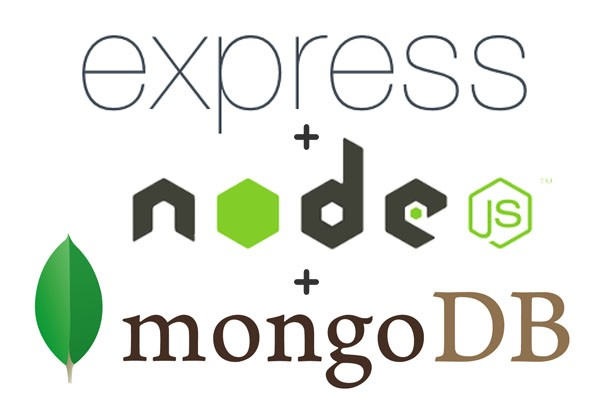

<h1 align="center">JavaScript Back-End</h1>

    

- 

<h2 align="center">За курса</h2>

Курсът е интензивен и цели да запознае учащите с разработката на сървърни JavaScript приложения върху платформата
Node.js, използвайки Express.js, като framework. По време на обучението ще разберем как да създадем сървър с Node.js, ще
се научим на сървър-клиент архитектурата и как да правим лесни и бързи data-driven web приложения с Node.js, Express.js
и MongoDB, използвайки съвременни похвати и инструменти. Ще се разглежда една от най-популярните нерелационни бази от
данни - MongoDB, заедно с библиотеката Mongoose за взимане на данни от нея. Към края на курса ще се изгради от нулата
един цялостен REST API, ползвайки Express.js и MongoDB.

- 

<h3 align="center"><i>List of MPA Apps</i></h3>

- [x] [01. Booking Uni](Exam%20Prep%201%20-%20bookUni)
- [x] [02. Theaters](Exam%20Prep%202%20-%20theaters)
- [x] [03. Shoe Shelf](Exam%20Prep%203%20-%20Shoe%20Shelf)
- [x] [04. Tutorials](Exam%20Prep%204%20-%20Tutorials)
- [x] [05. Cubicle](Cubicle)
